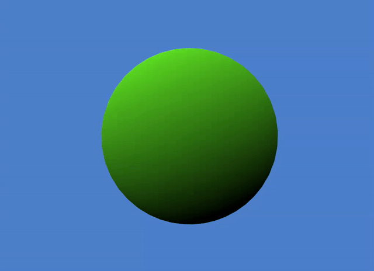

# Toon Water Shader – OpenGL Project

A stylized toon water shader implemented in OpenGL, originally developed as part of the course TDT4230 Graphics and Visualization at NTNU (Norwegian University of Science and Technology).

## Features

- **Toon Water Shader**: Step-wise depth coloring, refraction, light reflection, water surface distortion, foam and ripples, and vertex displacement animations.  
  

- **Toon Shader**: Step-wise lighting (diffuse, specular), rim outline effects.  
  

## Controls

- **Rotate Camera**: Hold Left or Right Mouse Button and move the mouse  
- **Switch Scenes**: Left / Right Arrow Keys  
- **Toggle Shader Features**: Up / Down Arrow Keys

## Getting Started

```bash
git clone --recursive https://github.com/Sternfruchtschnuppe/toon-water-shader-opengl.git
cd toon-water-shader
make run